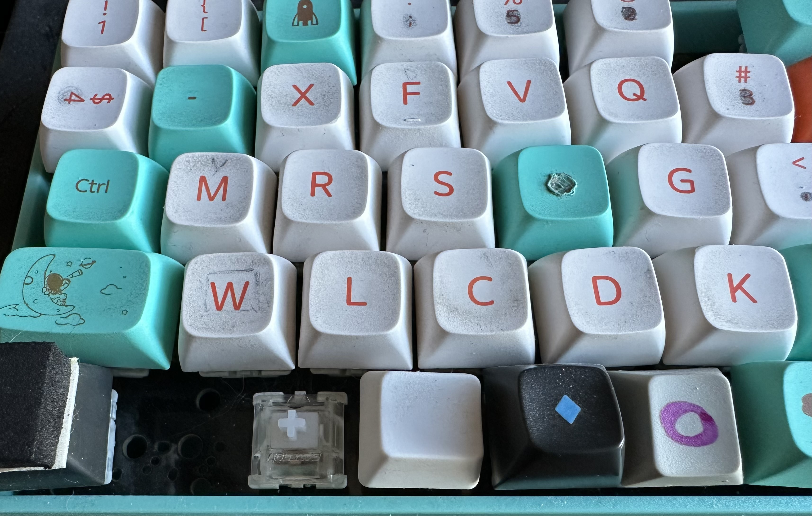

# Mrs. Thumbo

Mrs. Thumbo is a (set of) keyboard layout(s) derived from Colemak(-DH) (a
"quick-learn" spinoff), taking ideas from more modern layouts to improve
comfort: much less stretching (#1 original motivation due mostly to `m`),
fewer redirects, better SFBs, etc. (Only ever tried with matrix-like
keyboard.)



**Note to QWERTYzens:** Mrs. Thumbo has very little overlap with qwerty. If
you haven't trained for Colemak, you _could_ start from scratch and head
straight to one of [Oxey's tried and true layouts][11] or choose something
from [Cyanophage's visual list][1] that suits your goals. That said, Mrs.
Thumbo competes statistically with the best of them; it just hasn't been
tested beyond my own slow hands. There is also a path from QWERTY at the
bottom of this guide.

## Goals

- "Learnable" from Colemak in a few days to weeks (except `o`), by minimizing
  home row changes (and other high-freqs)
- Drastically decrease lateral stretching (eg, `m` moved from right hand),
  reduce redirects, improve (D)SFBs
- Alt-finger/pivot workarounds possible for nearly every (D)SFB
- Variants for various individual objectives (eg, no thumb)
- Progressive intermediate-step layout(s) possible from Colemak (and QWERTY!)
- Avoid untenable editor combo-key columns (eg, `pnb` on same finger,
  explanation below)

Mrs. Thumbo is ~easy~ possible to learn if you've been in Colemak land and
thinking it could be better: in the "Wolf" layout only ~4 high-impact keys have
changed significantly (~8 total), and most feel intuitive: **l o m a**. The
home row has all the same keys and only **m** and **a** have changed
(capitalized significant changes).

Here is the entry-point version, called "Wolf". Head down to the "PB&J"
section if you're wanting to make more changes for more reward; and note that
there's a clear progression from Wolf to PB&J, if you just start with Wolf,
and PB&J should probably be the end goal.

```
w L f p Q   j B u y '
M r s t g     n e i A
V x c d K   Z h , . /
        o
```

> - Sfb:  0.711%
> - Dsfb: 5.392%
> - Lsb:  0.595%
> - BadRedirects: 0.142%

Those are the simple stats I seem to care most about; all are from
[Oxey's Layout Playground][3] analyzer (with punctuation turned off
to get the most level playing field, and since anyone should come up with
their own prefs for those, depending on whether you write more code or
prose).

According to [Cyanophage][1], Mrs. Thumbo variants rank roughly #4 (with some
generous ties) across all ~30 layouts in Effort, SFBs, and DSFBs. Also does
well with Laterals and Scissors.

A few locations are still suboptimal: `p`, `c`, `n` all cause a lot of
theoretical SFBs, but I consider SFBs to be nearly 0% if you're willing to
learn to alt-finger stacks like `sc`, `pt`, etc; Mrs. Thumbo was designed to
make almost all pretty reasonable to alt. It's the "logjams" that are really
the problem that Thumbo avoids, which I define as having adjusted your hand to
avoid an SFB, but then hitting others and running out of fingers or tying a
knot.

Here's what's the same as Colemak-DH (if you squint at `w` and `k`):

```
w   f p     j   u y '
  r s t g     n e i
  x c d k     h , . /
```

And here are the ones I consider the "core anchors" that set the stage for all
the things that constrain Mrs. Thumbo into being what it is — the things that
I feel would be hardest to rewire our and hands for and didn't want to touch
in "Wolf" (though `p`/PB&J may be worth it, see section below):

```
    f p         u y '
  r s t g     n e i
    c d       h
```

As you can see, the whole Colemak-DH core is untouched (ignoring pinkies)!

**Bottom line: Mrs. Thumbo made a few good compromises to maintain the Colemak
feel, while still statistically ranking among the very best layouts.**

### About those lateral stretches

There are just `k` and `j` that cause a little stretching (and the `g` you're
quite used to).

For the left hand, `k`, the stretches are not too bad (depending on your
keyboard and hand size), by no longer being next to `n` and `e`; and `ck`
being a vely comfy stretch. `sk`/`rk` are not terrible but still feel far to me.

The `j` stretches are almost fully due to `je` and `ju`, and neither seems
like much effort. And you're use to them. You could swap it with `z` if it's
better on your keyboard. With `z` on bottom, I move my hand to use ring for
`e`.

## Intermediate Transitional (and other options)

> Time: couple days or weeks (depending on how thumb-o goes)

To get started, here's an intermediate training layout where only 3 keys have
changed! `m`, `a`, `o` (thumb).

```
q w f p b   j l u y '
M r s t g     n e i A
z x c d v   k h , . /
        O
```

You won't believe this, but you can stop here and call it good if you like.
The stats are already getting shiny and significantly better than Colemak-DH.

> - Sfb:  0.979%
> - Dsfb: 6.973%
> - Lsb:  0.618%
> - BadRedirects: 0.142%

Colemak-DH in comparison:

> - Sfb:  1.083%
> - Dsfb: 8.259%
> - Lsb:  1.923%
> - BadRedirects: 1.466%

The SFBs are about the same, but those other three are huge differences.

You could even start with only moving `o` to thumb (wait on `m` and `a`),
before doing the `m`/`a`/`o` swaps. Try just `o` for a week and see if you can
get past the hatred.

Honestly, the simplest possible semi-winning Colemak-DH mod (if you feel lateral
stretch pain) I can come up with is to simply swap `m` and `z` (though the
`qam` stack is pretty gross):

> - Sfb:  1.682%
> - Dsfb: 6.389%
> - Lsb:  0.678% <=== THIS IS GOOD!!
> - BadRedirects: 1.525%

Oooor, just move `m` to thumb and you're done.

> - Sfb:  0.845% <=== WOW!
> - Dsfb: 6.140%
> - Lsb:  0.678%
> - BadRedirects: 1.525%

Fun fact: `m` is the [first letter][2] of a lot of words, and I think that
makes it a pretty good thumb letter for faster learning.

## About the big (and small) moves

- `a` — OK, it's annoying to use right-hand for `Ctrl-a` (select-all). But
  it's only an issue because your right hand is on the mouse, so just
  triple-click instead. And yeah, it's also weird that `Ctrl-a` at the end of
  the keyboard is now to take you to _beginning_ of the line. This was a
  surprisingly easy move for my hands though, and really is what gets you to
  having the important vowel (and consonant) hand(s) (common to most modern
  layouts), which really helps with redirects.

- `w` — Barely notice the change since so close to original spot. But see
  option to put it on bottom, which is harder but better IMO, described below.

- `m` — Also surprisingly fast adjustment. Maybe since `m` was such a pain
  before. You'd have to get used to having this on left for many layouts
  anyway. Lots of long-term mistakes with it, though.

- `l` — Not sure how it ever ended up above `n` — bad SFBs there, so it has to
  go somewhere comfy, and this is a common stack, above (or below) `r`.

- `o` — Very challenging being on thumb. Wonder if it's worth trying only this
  move independently for a week to see if it's workable for you. Other layouts
  put `e` and `t` on thumb to seemingly great success (though haven't see any
  other do `o`), so we know it's possible. Just takes a lot of focus on
  learning. Was cutting my overall speed in half(!) for several days, and took
  at least a week to be even a little comfortable. I recommend omitting it
  from your typing trainer while learning the other changes. The reason `o`
  has nowhere "normal" to go is because we take it as a given that we're stuck
  with `n` on right-index, and we want a "vowel hand". `o` can't stay on
  right-pinky because of the awful `you` redirect. `o` can't go above or below
  `e` because `one` would be even worse than `you`. And anywhere else, SFBs go
  crazy. So either `n` or `o` ends up losing its place on the vowel hand.

- `b` — Kinda hard adjustment, but feels amazing. On this layout: if you feel
  yourself stretching, you're probably reaching for the wrong key.

- `k` — Optional, but easy change and really can help the lateral stretching.

- `v` — Happy uncommon experiment that saved a ton of stretching and feels
  very natural.

- `z`/`q`/`x` — Doesn't matter much where you put them. Move them around to
  your taste, but probaply keep `q` on the left (since `u` will logjam the
  right). I guess `z` on right is slightly annoying for _undo_ but NBD.

## Compelling Features

The scores are maybe even better than they first appear. The SFUs
are largely alt-able in easy ways. It inherits some quirks from Colemak, but
you're used to them.

Mrs. Wolf's key selling point is probably its "lateral stretch" score of
`0.595%`. This is what happens when you remove that impossible `mn` combo from
the right hand.

## Variants

The point of Mrs. Thumbo is to offer a set of feasible changes from Colemak that
are easy enough to adjust to while improving the overall feel, and to get more
folks comfortable with tweaking it to fit their priorities. The following are
some ideas you could adopt or riff off of.

### Mrs. Wolf

The original. See the top intro section. Most of its description applies to
the following variants.

### Mrs. You (version without thumb-`o`):

I feel that `o` on thumb is awesome _once you get used to it_.
Yes, it's slow to type `oo`.
And Someone may come along and prove it's a terrible idea.
I think that's unlikely, but here are a couple thumbless variants just
in case, or if you don't have thumbs. Also, foot pedal??

```
w l f p b   j Y O U '
m r s t g   k n e i a
v x c d q   z h , . /
```

> - Sfb:  1.098%
> - Dsfb: 7.431%
> - Lsb:  0.735%
> - BadRedirects: 0.108% <== JEEZ, THIS IS AMAZING (if right)

`ny`/`yn` are a really easy alt, and SFB is actually 0.802% if you discount
it.

The main challenges with this are:

- `one` DSFB has no good workaround (like Canary).

Intermediate (6 changes):

```
l w f p b   j y o u '
m r s t g     n e i a
q x c d v   k h , . /
```

### Mrs. Buoy (another thumbless variation, not tried)

Came upon this gem late in the game (and haven't actually tried it) but it
turns out that if you're willing to change the right-home to `n e A I`
(against the original principals), a new world opens up. These stats are great.
If you have already learned the `mrst` left-hand, then all that's left is a
few changes on right.

I'm skeptical about the right-pinky workload/alting (though halmak and semimak
pulled it off). There are workarounds for that if you like this one overall
(see what Graphite did).

```
w l f p j   ' b u O Y
m r s t g   k n e A I
v x c d q   z h , . /
```

> - Sfb:  0.773%
> - Dsfb: 5.984%
> - Lsb:  0.620%
> - BadRedirects: 0.229%

### Mrs. Fox (back to the thumb)

I tried moving `wl` and `vx` each (and combos) to top and bottom (maintaining
their order) — the analyzers treat them mostly the same.

```
V X f p Q   j B u y '
M r s t g     n e i A
W L c d K   Z h , . /
        o
```

I like the feel of `wl` on bottom (and `vx` on top). I did some
hand-calculating to conclude that it is indeed better for travel distance to
put `l` on the bottom (with `c` and `d` so near and dear). And then `w` needs
to be next to `l`. And you might want to keep `vx` on the bottom for
cut/paste purposes (though way overrated IMO). Maybe try both and decide for
yourself. It's a bigger departure from Colemak to have `vx` on top, and thus
slower to learn, but it's what I'm using now. Also, lots of folks believe
you shouldn't put high loads on non-index bottoms, but I find it pretty
comfortable with an active thumb-`o` already down there (and a naturally
tight, curly hand).

This makes for something of a secondary left-hand "home row" in `wlcdk`. Those
co-occur well together to minimize travel. And then the left-top row has
minimal work to do, similar to right-bottom. That makes for an interesting
asymmetry (high right, low left), but I don't see it causing problems. This is
Colemak's fault for putting `c` and `d` on bottom, and it's hard to change.

Another advantage of `wl` on bottom is that `rl` is an easy downward alt
(ring-over-middle), whereas the opposite is clumsier (ring and pinky without
careful lookahead).

### PB&J, drifting even further (my fave!)

Further diverging from Colemak, you can move `p` to the right and `b` down.
This opens up a spot on left for a ["magic"][10] key (above `t`) if you've
been wanting to try it (or whatever syntax is handy, like `-` for lisp, or `_`
for others). It's also very nice to have the prev/back/next mnemonics together
(almost like a WASD or HJKL) for those three for Emacs, shell, etc. I also
found the transition to this to be particularly easy given the spatial feeling
of `p`rev being on top, `n`ext right below it, `b`ack to the left. And it's
really interesting to discover that moving (`p`) to an identical position on
the opposite hand was easy! Stats are wild too, and it feels great. So this is
what I've landed on now for my daily driver.

It makes LSBs (lateral) significantly worse, but reaching for `b` isn't nearly
as bad as I had expected. And makes for a pretty easy `ph` alt.

Another (optional) move here is putting `v` on top-index. It eliminated the
scissory `v_l` trigram that had been feeling awkward. This move turned out to
be really helpful. It also had the great side-effect of putting punctuation
symmetrimcally on both upper pinkies, which is great for multiple "leader
keys" (`-` and `'`) as introduced by Vim. Eg, `-p` is the "project" menu, and
`'g` is for starting git commands. Maybe `-` isn't a good leader (`q` instead)
but you get the point ... kinda. So maybe I'll swap `q` and `-`.

```
- x f V q   j P u y '
m r s t g   B n e a i
w l c d k   z h , . /
        o
```

> - Sfb:  0.688%
> - Dsfb: 5.279%
> - Lsb:  1.478%
> - BadRedirects: 0.160%

### VeLOCD

Now if you want even less pinky effort, swap the `v` and `w`, but SFBs get a
worse — too many logjams IMO. But let's brand this tweak as "VeLOCD" anyway,
in case someone likes it.

```
- x f W q   j P u y '
m r s t g   B n e a i
V l c d k   z h , . /
        o
```

## How Mrs. Thumbo was designed (thank yous!!)

Lots of studying of existing layouts at [Cyanophage][1], and using the _Edit_
feature.

Experimenting with [Oxey's Layout Playground][3] (doesn't work on Linux
FF/chrome afaict fyi) for countless hours. Also the thoughtful considerations
explained on each published layout.

[Graphite][5]'s [Layout Doc][7] is a mind-expanding read.

Reading many insightful reddit threads on `r/KeyboardLayouts`.

Everyone who has published a layout! There's something to be learned from all
of them.

[Hands Down][13] family for the various thumb ideas and fascinating layouts.

## Interesting learnings

Several Colemak spinoffs are great. But none that I could find went very far
to eliminate lateral stretching. In the end, I realized that `m` was the only
huge culprit. But `v` and `b` were also great to move. I got comfortable
enough with [Canary][6], and felt some great improvements, but it was still
too stretchy (and has the `one` showstopper).

Nerts and its ilk are pretty neat. I got far enough with Graphite (tweaked to
`nrst`/`heia`) to be able to type (slooowly) and feel some clean/natural
movement, but it was way too hard to retrain my hands to do anything in Emacs,
and it felt like it would have been months before I could be productive. There
was also the major issue of winding up with a `pnb` column on left-pinky (or
anywhere) — that was way too much for Emacs pinky to handle. Really, `p`(rev)
and `n`(ext) (and `b`(ack)) would ideally be on all different fingers.

The Layout Playground is an amazing tool for experimenting. There are plenty
of standard layouts there to play with/start from. I was amazed by how easy it
is to severely tweak a layout and keep it usable with good stats.

Columns can often be inverted. Eg, `ptd` can become `dtp` without any
statistical penalty (except proximity, which isn't obvious), so feel free to
move those when they feel needed. This is particularly useful for cols 1/5/6.

Left and right hand design can be done somewhat independently. IOW, if you see
a left-hand layout you really like, use it, and do wtfyw with the right, and
vice versa.

A realization that the middle finger is long and dextrous and, eg, can
almost always reach over to hit the `v` (and `t` and `d`) and often needs to,
so when alt-ing, index is kinda responsible for only 5 keys, and middle gets
4+!

Punctuation/symbols really change the stats. I excluded them from most of the
analyses, but they have strong impact on several metrics, including redirects.
So experiment with them in the Playground and choose wisely.

## How to learn/practice

You're probably here because you already know Colemak, so these may go without
saying, but still:

- [Monkeytype][9] — so featureful and well done; use exclude lists
- [Keybr][8] — for extra repetition each time you make a change
- [Trigrams practice][12] — choose a dense exercise list that works the most
  common trigrams and load it into monkeytype

My personal learning timeline has felt pretty slow. It took me a few weeks of
messing around with several layouts, and then having to unlearn most of it,
including a few thumb attempts. I ended up a mess of Colemak/Canary/Graphite,
and a few others. Then once having settled on Mrs. Thumbo, then really Mrs. Fox,
and then even more changes, it took me a couple weeks to hit 50 WPM. However,
I was able to feel productive enough writing code in Emacs after a few days of
hitting monkeytype and keybr pretty hard.

## Alt fingering

Once you've reached with index for `p` or `b` you may get into trouble since
there's no other finger to reach farther with. Eg, `bun`, you really need to
hit `b` with middle and arrange from there. This applies to any layout for
those positions. The trick is looking ahead to see if there is a skipgram
coming, and reach for them with middle. With Colemak you may have gotten used
to reaching for `l` with middle, but now you have to retrain for `b`. You may
already have that reflex with `p` on the left.

Alts for most others have been taken into account with Mrs. Fox. One key is to
remember that (non-index) _downward_ alts don't take any planning. Eg, `fas`,
index flows naturally down to `s`, but going the other (`saf`) puts `s` on
middle but requires ring to swoop up for `f`. However, note that `fast` (and
moreso `fact`) requires planning to go with ring for `f` since you run out of
fingers at `t`. There will be words that are near impossible to alt. `cast` is
an example.

## Reference Implementation

Probably not useful with my keyboard's obscure setup, but at least the picture
gives some context for one attempt at easier alt-fingering, using QMK:
[anatak60][4](`mrswlf` branch).

[1]: https://cyanophage.github.io/
[2]: https://www.worldwidewords.org/qa/qa-ini1.htm
[3]: https://oxey.dev/playground/index.html
[4]: https://github.com/MicahElliott/anatak60
[5]: https://github.com/rdavison/graphite-layout
[6]: https://github.com/Apsu/Canary
[7]: https://docs.google.com/document/d/1_a5Nzbkwyk1o0bvTctZrtgsee9jSP-6I0q3A0_9Mzm0/edit
[8]: https://www.keybr.com/
[9]: https://monkeytype.com/
[10]: https://github.com/Ikcelaks/keyboard_layouts/blob/main/magic_sturdy/magic_sturdy.md
[11]: https://oxey.dev/index.html
[12]: https://www.reddit.com/r/typing/comments/172umsd/896_trigrams_in_200_words_a_new_selection_of/
[13]: https://sites.google.com/alanreiser.com/handsdown/home
[14]: https://forum.colemak.com/topic/1858-learn-colemak-in-steps-with-the-tarmak-layouts/

## Coming from QWERTY

### QWRT (not tried!)

This was just for fun, a qwerty spin-off that changes just a few letters as
the end-game (`a`/`e`/`l` the only major ones), but improves most stats 2-4x!

```
q w r t     y u i o p
L s d f g   h N k E A
z x c v b   J m
```

> - Sfb:  3.115%
> - Dsfb: 9.500%
> - Lsb:  1.339%
> - BadRedirects: 0.610%

Vs QWERTY stats:

> - Sfb:   6.496%
> - Dsfb: 10.708%
> - Lsb:   6.623%
> - BadRedirects: 1.401%

### Mrs. Qwerty, a learning sequence

More seriously now, if you are coming from qwerty and are interested in any
Thumbo variant, here is a sequence of some transitional layouts (in the spirit of
[Tarmak][14]) with pretty OK stats that get you progressively all the way
there. You probably want to spend a couple days to a week or so with each one
— at least that's the duration worked for me with Tarmak some years ago.

#### Week 1 (24% freq change)

Well, the stats for this first one are not good: better than qwerty but with
different pains; care was taken to not make it worse! `k` is not permanent,
but unimportant enough to float around through the month. `x` is another
floater. And `;` disappears because you can decide eventually where you want
it. This should be the hardest week, given the hand swapping, and still being
a terrible layout. But on the bright side, `l`, `e`, `a` are the only
heavy ones. And congrats!! You will now have a vowel hand!

_Changes 3 major keys: **L E A x k**_.
(The significant/important/major keys
being moved are upper-case on these "change lines", but in diagrams below, all
changes are capitalized.)

```
q w X r t    y u i o p
K s d f g    h j E A
z L c v b    n m
```

> 3.7, 11.7, 8.7, 0.5 (abbreviated stats)

#### Week 2 (20% freq change)

_4 more majors, with hand swap! and starting to feel much smoother: **F T M H k x**_

```
q w F r X    y u i o p
M s d T g    K j e a
z l c v b    n H
```

> 3.1, 10.1, 5.6, 0.4

#### Week 3 (18% freq change)

_4 more majors, all left hand: **V R S D**._

```
q w f V x    y u i o p
m R S t g    k j e a
z l c D b    n h
```

> 2.1, 9.2, 5.7, 0.4

#### Week 4 (14% freq change)

_4 more majors, right hand this time: **P U Y N j**_
(and you might move `j` to
bottom if it's better on your keyboard). You're very close with these, and
next week is just minor.

```
q w f v x    J P U o Y
m r s t g    k N e a I
z l c d b      h
```

> 1.0, 7.1, 0.6, 0.2

#### Week 5 (Only 3.5% freqs! You made it! This is the real thing now!)

2 more (semi-)majors: **W B z k**. (Swap `q` and `x` too if you want a tiny bit more
improvement.)

```
q Z f v x    j p u o y
m r s t g    B n e a i
W l c d K      h
```

> - Sfb:   0.791%
> - Dsfb:  6.134%
> - Lsb:   1.418%
> - BadRedirects: 0.228%

This is basically _Mrs. Buoy_ (but even slightly better) and can now be
tweaked to any of the others if wanted.
